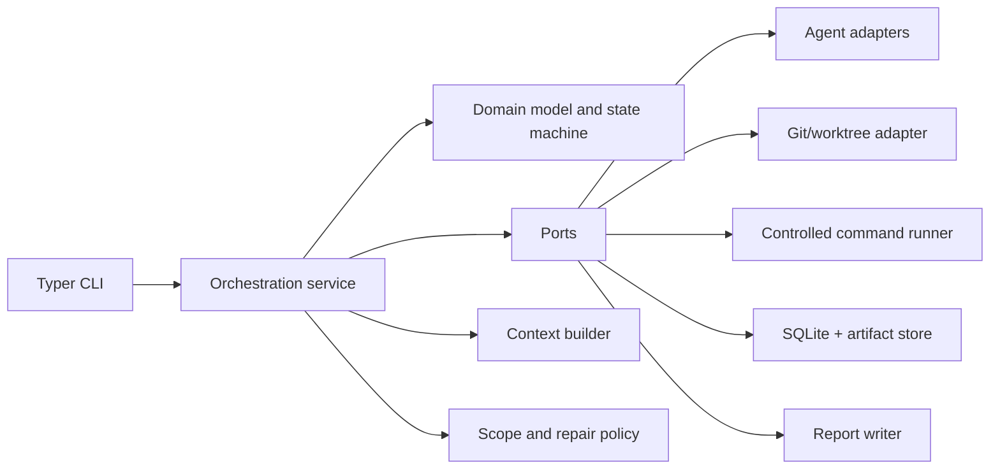
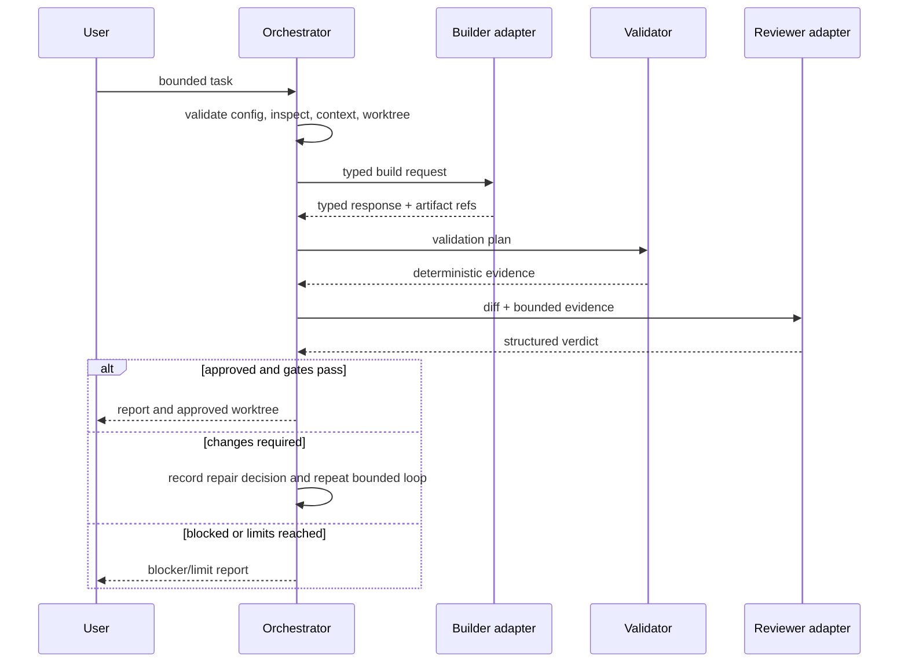

# Architecture

## Shape and dependency direction

Revanent is a single local process with ports-and-adapters boundaries. Dependencies
point inward: CLI and orchestration depend on domain types and interfaces; external
provider, Git, command, SQLite, and report implementations depend on those interfaces.
Domain modules never import an adapter.

## Components

- `domain`: stable IDs, runs, attempts, validation, review, budget, events, reports.
- `orchestration`: use cases and the sole workflow transition coordinator.
- `agents`: provider-neutral port plus fake/OpenCode/Codex adapters.
- `context`: deterministic relevance selection and inclusion rationale.
- `workspace` and `git`: repository inspection and owned worktree lifecycle.
- `validation`: typed validation plans and results using the command-runner port.
- `review` and `policy`: schema parsing, approval gates, repair and path decisions.
- `storage`: SQLite normalized current state and append-only significant events.
- `commands`: executable/path/environment/redaction policies and the sole local process adapter.
- `telemetry` and `reporting`: measured/estimated usage and evidence artifacts.
- `cli`: presentation and input only; it does not own workflow rules.

Packages are created when their work package starts, avoiding empty placeholders.

## Domain model

`Run` owns current `RunState`, task, repository/workspace identity, budgets, and
attempt counters. `WorkPackage` defines bounded objective and scope. Build,
validation, review, repair, usage, and approval records are immutable evidence with
stable identifiers. A `RunEvent` records every significant transition/decision.

The implemented P1-001 boundary lives in `revanent.domain`. Version-1 Pydantic models
are immutable, reject extra fields, require aware UTC timestamps, and serialize stable
IDs as canonical strings. A run cannot use Pydantic's unvalidated copy-update path.
`transition_run` is the only implemented state-change operation; it returns both the
fully revalidated next `Run` and its matching `StateTransition`. P1-002 adds versioned
`RunEvent` envelopes and the provider-independent `RunRepository` port without adding
SQLite imports to the domain.

Structured `ReviewResult` values use `APPROVED`, `CHANGES_REQUIRED`, or `BLOCKED`.
An `APPROVED` run additionally retains a passing local `ApprovalGate`; constructing or
deserializing approval without complete validation, parsing, scope, generated-file,
evidence, review-severity, and dirty-state gates fails validation.

P4-001 retains those domain contracts and adds the provider-neutral validation boundary
in `revanent.ports.validation`, ordered execution in `revanent.validation`, and pure
gate computation in `revanent.review`. Version-1 plans/results are immutable and
canonical. The runner converts literal validated command specifications to
`CommandRequest` values and uses only an injected `CommandRunner`. It preserves order,
records every planned command, and locally replays aggregate identity, chronology, and
policy. It imports no concrete runner, provider, Git, persistence, CLI, or orchestration.

`ReviewGate` consumes the original plan/result, a typed P3 REVIEWER response, and
`LocalApprovalEvidence`. Provider review is necessary but cannot set validation, scope,
generated/lockfile consistency, artifact completeness, repository cleanliness,
read-only authority, or side-effect facts. Stable finding IDs are derived locally from
canonical severity/summary order. Only a reason-free decision creates the existing
`ApprovalGate`; the service performs no I/O or state transition. See ADR-0008.

## Configuration boundary

`revanent.config` loads YAML with the safe loader, checks schema version 1 before model
validation, and returns an immutable `RevanentConfig`. Unknown keys/versions, invalid
limits, absolute/traversing or repository-wide allowed paths, duplicate commands,
conflicting paths, and approval-free push/merge settings are rejected explicitly.
Configuration errors summarize locations and rules without echoing input values.

## Controlled command boundary

`revanent.ports.commands` owns immutable version-1 `CommandRequest`, `CommandResult`,
`CommandStatus`, typed environment-entry/override, failure, bounded-output,
artifact-reference, cancellation, and
`CommandRunner` contracts. These types contain no subprocess or provider implementation.
`revanent.commands` implements the provider-independent policies and local adapter;
`subprocess` is imported only by `revanent.commands.local`. The environment doctor now
uses this port rather than a separate subprocess path.

An executable request names a configured capability, never a path or combined command
string. `ExecutablePolicy` selects the first usable absolute candidate in explicit
order, can build candidates from a selected PATH while excluding repository roots, and
records the resolved identity. `CommandPolicy` places runner-specific ceilings below
the hard request bounds. `PathPolicy` resolves existing working directories inside
approved roots and separately contains artifact targets. `EnvironmentPolicy` builds a
bounded child environment from an explicit baseline plus allowlisted overrides;
Windows keys compare case-insensitively.

The local adapter launches argument lists with `shell=False`, drains stdout and stderr
on separate threads, uses monotonic duration/timeout measurement and UTC timestamps,
and normalizes policy rejection, launch failure, nonzero exit, timeout, cancellation,
artifact failure, and internal failure. Retained source bytes and sanitized
representation truncation are independently bounded and reported. Overflow artifacts
are redacted in memory, byte-bounded, written atomically into an approved directory,
and exposed through typed references.

On POSIX the runner creates and terminates a process group. On Windows it creates a
new process group but standard-library termination is guaranteed only for the direct
child. It is not a sandbox: authorized tools retain the host permissions, descendant,
filesystem, and network capabilities available to them. Filesystem validation is
subject to validation/use races. See ADR-0004.

## Agent boundary

`revanent.ports.agents` owns the provider-neutral `AgentAdapter` protocol and immutable,
strict version-1 capability, request, response, role-payload, status, failure, usage,
diagnostic, and artifact-reference contracts. It depends only on domain identities,
the read-only cancellation protocol, immutable domain review evidence, Pydantic, and the
standard library. It imports no provider, subprocess, Git, SQLite, CLI, or orchestration
implementation.

Roles are `BUILDER`, `REVIEWER`, and `REPAIRER`. Builder and repairer requests explicitly
require repository-write support; reviewers are invariantly read-only. Repair support,
structured output, timeout, cancellation, usage reporting, artifact references,
availability, provider/adapter identity, and access modes are explicit capabilities.
Model names never grant permissions. Responses correlate the invocation, run, work
package, attempt identity/number, role, and expected response schema exactly. Provider
file/command/change/review fields remain unverified claims and no agent type can create
local approval-gate evidence or change run state.

`revanent.agents.opencode` and `revanent.agents.codex` implement infrastructure adapters
over that port. They receive `CommandRunner`, verified detection results, and typed
settings rather than importing the concrete runner. Detection uses bounded version/help
probes only. OpenCode exposes BUILDER only. Codex review and repair are separate frozen
argument surfaces: review uses `read-only`; repair uses `workspace-write` and requires an
explicit constructor decision. Prompts use bounded stdin. Provider JSONL framing is
validated before P3-001 schema, correlation, and semantic validation. See ADR-0007.

`revanent.agents.base` bounds bytes before strict UTF-8/JSON parsing, rejects duplicate
keys, trailing data, NaN/infinity, excessive nesting/items, unknown versions/fields,
invalid enums/IDs/paths/timestamps, correlation differences, and request-specific
artifact/usage violations. Known sensitive values are redacted before canonical model
validation. A rejection returns sanitized `INVALID_OUTPUT` evidence correlated from the
trusted request; the raw payload never enters errors.

`revanent.agents.fake` supplies the first adapter. Immutable scenarios contain finite
ordered steps with exact canonical request hashes, explicit UTC timing/duration,
bounded cancellation checkpoints, and typed outcomes or bounded raw bytes. Compatibility
failures and pre-cancellation do not consume a step; execution-time cancellation and
timeout do. Instances have isolated counters and a lock. Re-instantiating an adapter
over the same scenario is deterministic in-memory replay, not durable replay storage.
See ADR-0006.

## Context boundary

`revanent.ports.context` owns immutable strict schema-version-1 context requests, typed
discovery evidence, candidates, items, exclusions, packages, manifests, failures, and the
selector protocol. The local `revanent.context` implementation consumes only explicit task,
changed/diff, validation, review, attempt, repair-decision, governing-document, and approved
artifact evidence. It expands direct Python imports and exact `test_<module>.py` conventions
under independent depth/count/traversal bounds; it performs no semantic search, target import,
provider call, subprocess, Git command, or network request.

TaskSpecification allowed/forbidden scope is authoritative and forbidden patterns win. One
reader owns all content access, resolved structural containment, link/junction refusal,
regular-file checks, bounded reads, and before/after identity/size/mtime consistency. Selection
then applies binary/UTF-8/secret policy, injected redaction, role-aware required/preferred/
optional priority, deterministic UTF-8 truncation, and same-authority/trust content
deduplication. Every item keeps source, authority, trust, target role, inclusion reasons,
correlations, byte counts, redaction/truncation state, safe digests, and duplicate aliases.

`ContextManifest` is metadata-only and canonical: it contains no absolute root, raw provider
payload, context body, token, or cost field. `ContextPackage` holds the bounded current-process
bodies separately and projects them through the existing `AgentRequest.context` references;
providers only format validated references inside their adapters. See ADR-0010.

## Safe Git and worktree boundary

`revanent.ports.git` owns immutable version-1 repository identity/status/snapshot,
worktree snapshot/request/result/ownership, operation-status, stable `WorktreeId`,
error, and `GitRepository` contracts. These types expose no `CommandResult` or raw Git
output. `revanent.git` implements protected-branch/reference policy, NUL-delimited
porcelain parsers, the dedicated ownership store, and `LocalGitRepository`; it imports
no subprocess implementation and sends every Git invocation through `CommandRunner`.

Repository identity records the canonical inspected worktree root, per-worktree Git
directory, common Git directory, object format, and sorted root commits reachable from
the inspected HEAD. Its `repository_id` hashes the normalized common directory, object
format, and root commits, excluding the per-worktree root so linked worktrees match.
Moving/replacing the common repository or introducing unrelated root history changes
identity and blocks ownership verification. This is strong local correlation evidence,
not a cryptographic Git repository UUID.

Inspection resolves HEAD to a commit, parses `status --porcelain=v2 -z --branch`, parses
`worktree list --porcelain -z`, resolves a locally configured `origin/HEAD` when present,
and reads per-worktree operation markers for merge, rebase, cherry-pick, revert, bisect,
and sequencer state. Literal NUL separation retains supported spaces, Unicode, quotes,
tabs, newlines, and shell metacharacters. Truncated, undecodable, incomplete, unborn,
bare, or malformed data fails explicitly.

Creation is two-phase and fail-closed. A clean, conflict-free, operation-free source is
inspected; the exact base commit, dedicated non-protected `revanent/` branch, contained
target, branch/path/registry collisions, checkout filters, and internal ignored roots
are checked; mutation-sensitive facts are rechecked; normal `git worktree add -b` runs;
and live common identity, path, branch, HEAD, and registration are verified. Only then
does ownership become `ACTIVE`. The original worktree is never checked out, stashed,
reset, cleaned, or committed. Any post-record failure preserves `PARTIAL` evidence and
does not attempt destructive rollback.

Ownership JSON lives in a separate caller-provided Revanent state directory. Validated
ID-derived names, create-exclusive per-ID locks, bounded reads, restrictive temporary
files, sync, and atomic replacement protect local durability/concurrency. Records carry
schema version, worktree/run IDs, complete repository identity, source/worktree paths,
branch, immutable base/created HEAD, UTC creation time, Revanent version, lifecycle,
partial category, and cleanup evidence. The record is necessary but never sufficient:
live Git metadata and path containment must also match.

Cleanup accepts only an `ACTIVE`, live-verified owned worktree whose branch remains
dedicated/non-protected and whose HEAD descends from the base. Tracked, staged,
untracked, conflicted, ignored, locked, or in-progress state refuses cleanup. The only
removal is normal `git worktree remove`; there is no force retry and no branch deletion.
Git deregistration is verified before the retained record becomes `REMOVED`. Stale
locks, partial/missing/replaced worktrees, and ownership ambiguity stay blocked. See
ADR-0005.

## Workflow and ownership

The P4-002 `OrchestrationService` is the sole application coordinator. It depends only on
run/journal, Git, agent, validation, local-evidence, review-gate, cancellation, clock, and
ID ports. It loads the durable run, calls the existing `transition_run` authority, and
persists accepted state plus an event through `RunRepository`; it never assigns `Run`
state or duplicates the transition table.

Every worktree, builder, validation, reviewer, or repair side effect has a strict,
versioned attempt model. The coordinator verifies current run/worktree assumptions,
appends a stable intent under the current revision/state, rechecks run currency, invokes
once, then appends the normalized outcome. Agent public text/diagnostics and command stream
text are not embedded in the journal; bounded structured usage, evidence, and validated
artifact references remain. Repository source remains protected by P2-002 and the task
worktree is live-verified before each risky phase. The coordinator never cleans it.

The finite pipeline is CREATED -> PLANNING -> CONTEXT_PREPARING -> WORKSPACE_PREPARING ->
BUILDING -> VALIDATING -> REVIEWING, with explicit REPAIRING -> VALIDATING cycles. Every
potentially mutating build/repair reaches validation. Reviewer responses are read-only and
only the P4-001 `ReviewGate` can return the `ApprovalGate` used for APPROVED. Repair
selection is a pure local policy; providers cannot choose strategy or authority.

## Persistence and recovery

SQLite uses explicit schema versions and forward migrations. Current state and its
corresponding event commit atomically. Side effects receive stable IDs. Library-level
continuation loads state, verifies owned-worktree identity, and resumes from the last
durable boundary. A completed outcome at the same state/revision is reused rather than
reinvoked. Intent without outcome is reconciled: live ownership can establish a created
worktree only when the active record matches the durable run, source/target paths, branch,
and common repository identity; incomplete mutating work remains ambiguous and blocks
automatic continuation. Reviewer cancellation has terminal cancellation precedence over
the review gate's conservative blocked classification. This is at-most-once initiation
with durable reconciliation, not exactly-once execution.

The implemented SQLite schema version 4 has seven tables: ordered migration history,
revisioned current runs, append-only run events/orchestration records, and append-only
usage records, budget reservations, and budget settlements.
Complete bounded domain JSON is
stored alongside normalized identity/version/state/timestamp/order columns and is
always reloaded through canonical Pydantic validation. Database checks enforce JSON
validity and normalized consistency; event update/delete triggers enforce append-only
history. Initial run creation stores revision zero and no event. Transition events use
monotonic per-run sequences, so equal timestamps still have deterministic order.

The SQLite adapter opens one connection per operation, enables and verifies foreign
keys, uses read-only URI connections for reads, and controls transactions explicitly.
`BEGIN IMMEDIATE` serializes writers; optimistic revisions and expected snapshot
comparison prevent lost updates. Orchestration records additionally bind run revision,
expected state, attempt ID/kind, and intent/outcome/reconciliation stage with unique
per-run ordering and stage constraints. Stable event/record IDs support an immediately
repeated identical boundary without duplication. Schema initialization is idempotent and
transactionally applies the inspectable forward-only migration list. Newer or malformed
schema histories and corrupt payloads fail explicitly without automatic repair.

Migration 3 transactionally rebuilds only the append-only orchestration table constraint to
admit `CONTEXT` attempt evidence, copies all existing P4 rows, and recreates its index and
append-only triggers. Context intents and metadata-only manifest outcomes are revision/state
guarded like other attempts. Selected bodies never enter SQLite. A current-process duplicate
uses its validated package; process continuation re-reads authorized inputs and must reproduce
the durable manifest before any provider invocation.

## Usage telemetry and budgets

P5-002 adds provider-neutral version-1 usage, provenance, policy, reservation, settlement,
and decision contracts. Context bytes and validation duration are `MEASURED`; structured
provider tokens are `PROVIDER_REPORTED`; configured Decimal cost calculations are
`ESTIMATED`; absent metrics are numeric-free `UNAVAILABLE`. `UNRESOLVED` is a separate
reservation lifecycle state retaining capacity when launch or completion is ambiguous.
Local bytes are never token estimates, and estimated cost is not actual billing.

Every applicable agent role and validation persists intent before atomic reservation,
invokes only after reservation commit, persists its normalized outcome, and then settles.
Validation uses a derived plan that never increases command timeouts or exceeds remaining
whole-second allowance. Actual duration overage is retained and blocks later consumption.
The state machine remains attempt authority; telemetry derives attempt usage from durable
activity rather than maintaining a second run counter.

Migration 4 stores metadata only. `reserve_if_allowed` and `settle_reservation` run under
`BEGIN IMMEDIATE`, include active reservations, use exact integer/Decimal arithmetic, and
make identical retries idempotent while rejecting payload conflicts. Restart settlement
reuses persisted outcomes without provider/validator replay. Missing trusted outcomes become
`UNRESOLVED`; there is no time-based expiry. See ADR-0011.

P4-002 proves close/reopen outcome reuse, exact worktree-creation reconciliation (including
another-run refusal), in-flight reviewer cancellation, refusal to replay incomplete
mutating work, stale-coordinator rejection, and rollback before launch.
P6-002 still owns the user-facing resume/status/report command and recovery UX; artifact
integrity beyond existing typed references remains later work.

## Trust boundaries

Target repositories, provider/model output, subprocess output, configuration, and
network services are untrusted. Revanent validates schemas and normalized paths.
OpenCode/Codex receive filtered context and environment. Git and executable calls go
through policy-aware adapters. No adapter receives blanket authority merely because
it executes locally. See `SECURITY_AND_THREAT_MODEL.md`.

## Key sequence

The implemented technology, persistence, typed-schema, command, safe-worktree, and
agent-envelope choices are recorded in ADR-0001 through ADR-0006.
