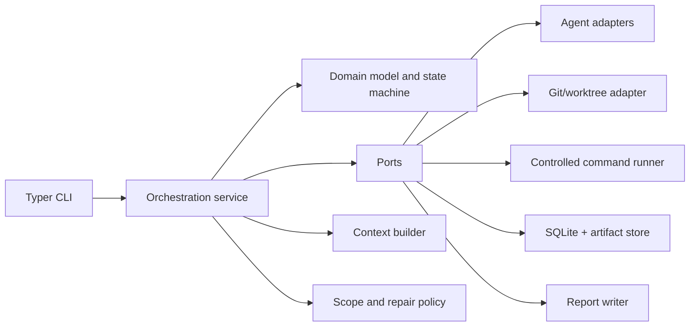
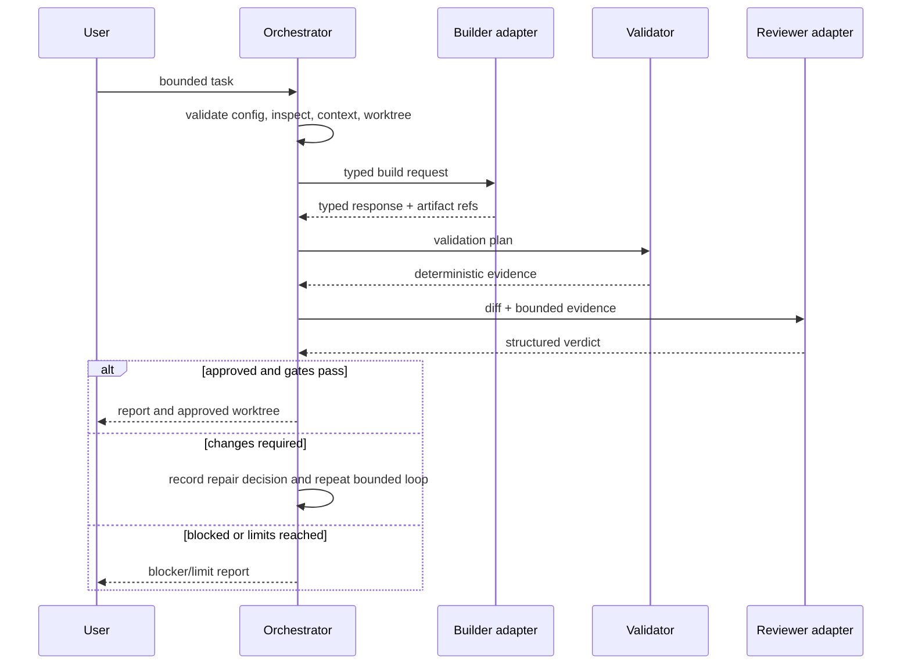

# Architecture

## Shape and dependency direction

Revanent is a single local process with ports-and-adapters boundaries. Dependencies
point inward: CLI and orchestration depend on domain types and interfaces; external
provider, Git, command, SQLite, and report implementations depend on those interfaces.
Domain modules never import an adapter.

## Components

- `domain`: stable IDs, runs, attempts, validation, review, budget, events, reports.
- `orchestration`: use cases and the sole workflow transition coordinator.
- `agents`: provider-neutral port plus fake/OpenCode/Codex adapters.
- `context`: deterministic relevance selection and inclusion rationale.
- `workspace` and `git`: repository inspection and owned worktree lifecycle.
- `validation`: typed validation plans and results using the command-runner port.
- `review` and `policy`: schema parsing, approval gates, repair and path decisions.
- `storage`: SQLite normalized current state and append-only significant events.
- `telemetry` and `reporting`: measured/estimated usage and evidence artifacts.
- `cli`: presentation and input only; it does not own workflow rules.

Packages are created when their work package starts, avoiding empty placeholders.

## Domain model

`Run` owns current `RunState`, task, repository/workspace identity, budgets, and
attempt counters. `WorkPackage` defines bounded objective and scope. Build,
validation, review, repair, usage, and approval records are immutable evidence with
stable identifiers. A `RunEvent` records every significant transition/decision.

## Workflow and ownership

The orchestration service loads a run, asks the central state machine to authorize a
transition, persists state plus an event transactionally, and only then initiates the
next side effect. Repository source remains owned by Git/worktrees. SQLite owns
normalized metadata; `.revanent/runs/<id>/` owns bounded artifacts. Large/raw output
is referenced rather than embedded in normalized records.

## Persistence and recovery

SQLite uses explicit schema versions and forward migrations. Current state and its
corresponding event commit atomically. Side effects receive idempotency keys. Resume
loads state, verifies base repository/worktree identity and artifact integrity, then
continues from the last durable boundary; it never blindly repeats completed Git or
agent side effects. Interrupted in-flight commands become explicit failed/interrupted
attempts after reconciliation.

## Trust boundaries

Target repositories, provider/model output, subprocess output, configuration, and
network services are untrusted. Revanent validates schemas and normalized paths.
OpenCode/Codex receive filtered context and environment. Git and executable calls go
through policy-aware adapters. No adapter receives blanket authority merely because
it executes locally. See `SECURITY_AND_THREAT_MODEL.md`.

## Key sequence

The initial technology and persistence choices are recorded in ADR-0001 and ADR-0002.
