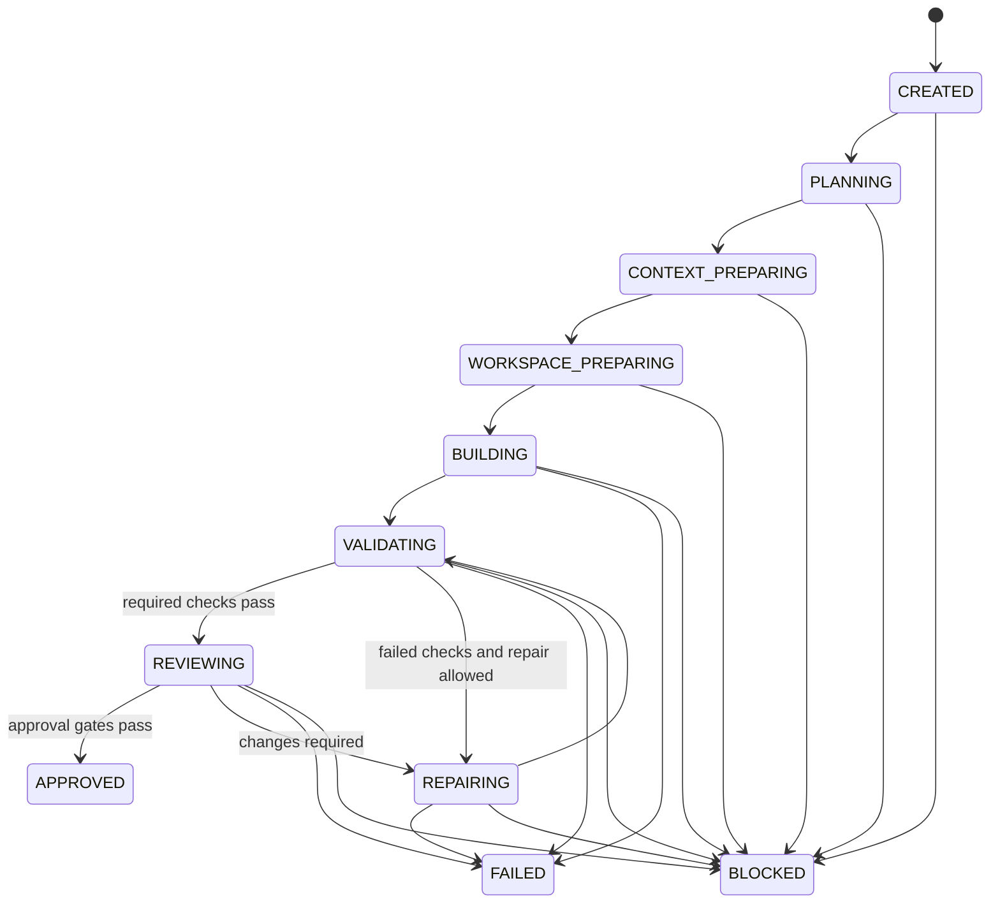

# Workflow State Machine

The domain state machine is the only authority for run-state changes. Adapters may
report outcomes but cannot mutate state. Every accepted transition produces an event;
every invalid transition raises a typed error and performs no side effect.

## States

- `CREATED`: durable task accepted, no planning side effect started.
- `PLANNING`: work package, scope, and budgets are being resolved.
- `CONTEXT_PREPARING`: bounded context is being selected.
- `WORKSPACE_PREPARING`: repository/worktree checks and creation are in progress.
- `BUILDING`: a builder attempt is in flight.
- `VALIDATING`: deterministic checks are in flight.
- `REVIEWING`: structured senior review is in flight.
- `REPAIRING`: an authorized bounded repair is in flight.
- `APPROVED`: terminal; all gates passed.
- `FAILED`: terminal; an internal or validation outcome cannot continue within policy.
- `BLOCKED`: terminal; an external prerequisite or essential human decision is missing.
- `CANCELLED`: terminal; cancellation was requested and in-flight work reconciled.

## Permitted transitions

Any nonterminal state may transition to `CANCELLED` after cancellation reconciliation.
`BLOCKED`, `FAILED`, `CANCELLED`, and `APPROVED` do not transition; resume creates a
new continuation record only where later policy explicitly permits it.

Approval additionally requires successful required validation, parseable schema,
no unresolved critical/high finding, justified scope, consistent generated/lock
files, complete evidence, and no unexplained dirty state.
