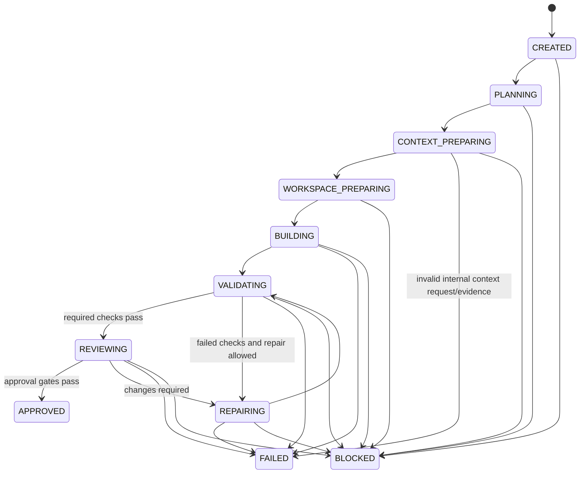

# Workflow State Machine

The domain state machine is the only authority for run-state changes. Adapters may
report outcomes but cannot mutate state. Every accepted transition produces an event;
every invalid transition raises a typed error and performs no side effect.

Evidence reports are read-only projections and are not state-machine transitions. They may mark
evidence incomplete or invalid but never reconcile, settle, cancel, approve, repair, or otherwise
alter a Run.

## States

- `CREATED`: durable task accepted, no planning side effect started.
- `PLANNING`: work package, scope, and budgets are being resolved.
- `CONTEXT_PREPARING`: bounded context is being selected.
- `WORKSPACE_PREPARING`: repository/worktree checks and creation are in progress.
- `BUILDING`: a builder attempt is in flight.
- `VALIDATING`: deterministic checks are in flight.
- `REVIEWING`: structured senior review is in flight.
- `REPAIRING`: an authorized bounded repair is in flight.
- `APPROVED`: terminal; all gates passed.
- `FAILED`: terminal; an internal or validation outcome cannot continue within policy.
- `BLOCKED`: terminal; an external prerequisite or essential human decision is missing.
- `CANCELLED`: terminal; cancellation was requested and in-flight work reconciled.

## Permitted transitions

Any nonterminal state may transition to `CANCELLED` after cancellation reconciliation.
`BLOCKED`, `FAILED`, `CANCELLED`, and `APPROVED` do not transition; resume creates a
new continuation record only where later policy explicitly permits it.

Approval additionally requires successful required validation, parseable schema,
no unresolved critical/high finding, justified scope, consistent generated/lock
files, complete evidence, and no unexplained dirty state.

## Implemented transition contract

P1-001 implements the table above in one immutable mapping. `transition_run` accepts a
current immutable `Run`, destination, aware UTC timestamp, bounded reason, optional
bounded metadata, and approval evidence only when entering `APPROVED`. It returns a
new fully validated run and a matching `StateTransition`; the input run is unchanged.
Metadata keys are unique and sorted for deterministic serialization. A timestamp may
not precede the current durable timestamp.

Direct assignment is blocked by frozen models, and `Run.model_copy(update=...)` is
disabled because Pydantic copy updates do not validate. Deserializing `APPROVED`
without complete passing evidence is also rejected. P1-002 wraps accepted transitions
in append-only, per-run sequenced `RunEvent` records and atomically commits the event
with the new current state. Storage re-invokes this authoritative transition function
to verify the supplied snapshot; it does not define an independent transition table.

P2-002 supplies the typed repository inspection and owned-worktree primitive required
by `WORKSPACE_PREPARING`: clean source, exact base, ownership creation, live verification,
partial preservation, and safe cleanup outcomes are explicit. No orchestration service
invokes it yet, and P2-002 does not add or bypass state transitions. A later orchestrator
must persist its durable boundary before advancing to `BUILDING` and must map ownership
ambiguity to `BLOCKED` rather than guessing recovery.

P4-001 supplies immutable validation evidence and a pure local review-gate decision that
P4-002 orchestration uses. Neither `ValidationRunner` nor `ReviewGate` calls
`transition_run`, persists state, or changes a `Run`.

P4-002 implements the finite coordinator without changing the transition table. CREATED,
PLANNING, and CONTEXT_PREPARING advance through durable transition events before workspace
preparation. Worktree creation, builder, validation, reviewer, and repair execution each
have append-only intent/outcome evidence under the current run revision/state. The
coordinator passes only a locally constructed P4-001 `ApprovalGate` to
`REVIEWING -> APPROVED`; provider verdict alone remains insufficient.

Every build and repair attempt that completed or may have mutated transitions to
VALIDATING. Passing required validation enters REVIEWING. Ordinary validation/review
defects enter REPAIRING only while deterministic policy, scope, reconciliation, capability,
authorization, and limits permit it. Invalid/timed-out validation evidence fails; missing
required tooling blocks. Repair returns only to VALIDATING. Attempt counters increment on
the accepted phase-exit transition and cannot exceed immutable run budgets.

Terminal mapping follows both policy and the authoritative edge set. Internal/invalid or
exhausted outcomes use FAILED where permitted. Missing dependencies, ownership ambiguity,
unresolved recovery, absent authority, and early-phase limit exhaustion use BLOCKED.
Cancellation from any nonterminal state preserves attempts and enters CANCELLED through
`transition_run`; a reviewer response normalized as cancelled takes cancellation precedence
over the review gate's conservative blocked classification. Terminal calls return the
stored terminal result and never transition.

Crash continuation does not add resume edges. A persisted outcome at the current
state/revision is consumed without reinvocation. Intent without outcome is reconciled;
live workspace evidence must match the durable run, source/target paths, branch, and
repository identity, while mismatches are `INCOMPATIBLE`. Ambiguous mutating work blocks
rather than replaying. A Phase-6 resume command will call these library semantics and must
not transition terminal runs or invent a second table.

P5-001 gives CONTEXT_PREPARING its concrete durable boundary. For each required target role,
the coordinator appends a revision/state-owned context intent, invokes only the injected
`ContextSelectorPort`, and appends a metadata-only complete manifest or sanitized failure.
Every role must complete before WORKSPACE_PREPARING. Missing external evidence, repository/
artifact identity mismatch, required oversize/incompleteness, or an exhausted file race blocks;
an internally invalid request/evidence result uses the added CONTEXT_PREPARING -> FAILED edge.
Cancellation and stale revision checks happen before selection, and no provider/workspace/Git
mutation launches on context failure.

A current-process duplicate reuses its validated package. After process continuation, selected
bodies are re-read through the bounded reader and must reproduce the persisted manifest before
later agent execution. This is deterministic rematerialization, not filesystem snapshot or
general artifact-store durability. The selector never changes Run state itself.

P5-002 does not add transitions. Before every applicable agent invocation and validation run,
the coordinator persists intent and atomically reserves budget. A valid prelaunch refusal
persists a blocked outcome and maps through the existing table; stale revision remains a
distinct no-execution result. Validation timeout allowance never exceeds declared or remaining
duration, and measured overage enters `FAILED` with `RUN_DURATION_EXHAUSTED` before later work.
An unresolved prior reservation enters `BLOCKED`. Cancellation remains `CANCELLED`; telemetry
availability never grants write, repair, review, or approval authority. Outcome persistence
precedes settlement, and restart settlement does not reinvoke or create a new state edge.

P6-001 adds no workflow transition. `init`, `config validate`, `doctor`, and `agents detect`
may inspect repository/configuration/provider capability facts but cannot create a run, worktree,
attempt, event, reservation, report, approval, or provider invocation. User-facing stateful
workflow selection remains P6-002.
